# 📊 Skema Data — Dashboard BI BPJS Rawat Inap (RSU AIA)

Dokumentasi *star schema* (data warehouse) yang menjadi sumber data dashboard.
Lingkup: **klaim BPJS pasien Rawat Inap** RSU Ayah Ibu Anak Indonesia (Tipe A), periode **2020–2025**.

- **Model:** Star schema / *fact constellation* (banyak fakta berbagi dimensi).
- **Isi:** **11 dimensi** + **5 fakta** (CSV di folder `data/`).
- **Sumber transform:** data lebar asli di `data/_wide_backup/`, diubah jadi skema ini oleh `data/build_star.py` (lossless — angka identik).
- **Konsumsi:** `app.py` membaca dimensi & fakta, lalu *join* jadi tabel analisis.

> 📐 **Lanjut baca:** [`CONCEPTUAL_MODEL.md`](CONCEPTUAL_MODEL.md) — model konseptual **DFM (Dimensional Fact Model)** per fakta beserta gambarnya (`conceptual_fact_*.png` / `.svg` / `.drawio`). Dokumen ini menjelaskan skema **fisik/aktual**; conceptual model menjelaskan desain **dimensional** (measures, hierarki dimensi, degenerate dimension) — termasuk beberapa fakta versi *ideal* (mis. peresepan obat, okupansi harian).

---

## 1. Diagram Hubungan (ERD)

```mermaid
erDiagram
    dim_waktu        ||--o{ fact_klaim_ri              : "tgl_masuk / tgl_keluar"
    dim_pasien       ||--o{ fact_klaim_ri              : "id_pasien"
    dim_icd10        ||--o{ fact_klaim_ri              : "kode_icd"
    dim_ina_cbg      ||--o{ fact_klaim_ri              : "kode_inacbg"
    dim_departemen   ||--o{ fact_klaim_ri              : "id_departemen"
    dim_kelas        ||--o{ fact_klaim_ri              : "id_kelas"

    dim_departemen   ||--o{ fact_penunjang_diagnostik  : "id_departemen"
    dim_kelas        ||--o{ fact_penunjang_diagnostik  : "id_kelas"
    dim_lab          ||--o{ fact_penunjang_diagnostik  : "jenis_lab"
    dim_radiologi    ||--o{ fact_penunjang_diagnostik  : "modalitas_radiologi"

    dim_departemen   ||--o{ fact_operasi               : "id_departemen"
    dim_kelas        ||--o{ fact_operasi               : "id_kelas"
    dim_ruang_operasi||--o{ fact_operasi               : "id_ruang_operasi"
    dim_waktu        ||--o{ fact_operasi               : "tgl_operasi"

    dim_kelas        ||--o{ fact_okupansi_kamar        : "id_kelas"
    dim_kelas        ||--o{ dim_tempat_tidur           : "id_kelas"
```

> Catatan: `fact_penunjang_diagnostik` & `fact_operasi` juga menyimpan `id_admisi`
> sebagai **degenerate dimension** (kunci admisi) untuk *drill-across* ke `fact_klaim_ri`.

---

## 2. DIMENSI (konteks: *siapa, apa, kapan, di mana*)

### `dim_waktu` — *2.212 baris*
Kalender harian. Tiap tanggal di fakta merujuk ke sini.
| Kolom | Tipe | Keterangan |
|---|---|---|
| tanggal *(PK)* | date | Kunci tanggal (YYYY-MM-DD) |
| tahun | int | Tahun |
| bulan | int | Bulan (1–12) |
| nama_bulan | text | Nama bulan (Januari…) |
| nama_hari | text | Hari (Senin…Minggu) |
| kuartal | text | Q1–Q4 |

→ **Guna:** tren bulanan/tahunan/kuartal.

### `dim_pasien` — *44.389 baris*
Master pasien.
| Kolom | Tipe | Keterangan |
|---|---|---|
| id_pasien *(PK)* | text | ID pasien |
| nama_pasien | text | Nama |
| jenis_kelamin | text | L / P |
| tanggal_lahir | date | Tanggal lahir |
| alamat | text | Alamat |

→ **Guna:** jumlah pasien unik, analisis readmisi.

### `dim_icd10` — *18 baris*
Master diagnosis (kode ICD-10).
| Kolom | Tipe | Keterangan |
|---|---|---|
| kode_icd *(PK)* | text | Kode ICD-10 (mis. I63) |
| nama_diagnosis | text | Nama penyakit |
| kategori_penyakit | text | Kronis / Infeksi / Akut / Maternal |

→ **Guna:** Top diagnosis penyumbang kerugian, kategori penyakit.

### `dim_ina_cbg` — *18 baris*
Master grup pembayaran BPJS (INA-CBG).
| Kolom | Tipe | Keterangan |
|---|---|---|
| kode_inacbg *(PK)* | text | Kode grup (mis. I-4-13-I) |
| deskripsi | text | Deskripsi grup |
| tarif_dasar | int | Tarif paket dasar (Rp) |
| alos_standar | int | Lama rawat standar (hari) |

→ **Guna:** dasar penentu tarif klaim (referensi).

### `dim_departemen` — *7 baris*
| Kolom | Tipe | Keterangan |
|---|---|---|
| id_departemen *(PK)* | int | ID departemen |
| nama_departemen | text | Nama (Jantung, Bedah, …) |
| jumlah_dokter | int | Jumlah dokter |

→ **Guna:** breakdown per departemen (dimensi bersama klaim & operasi).

### `dim_kelas` — *4 baris*
| Kolom | Tipe | Keterangan |
|---|---|---|
| id_kelas *(PK)* | int | ID kelas |
| nama_kelas | text | VIP / Kelas 1 / 2 / 3 |
| tarif_kamar_per_hari | int | Tarif akomodasi/hari (Rp) |

→ **Guna:** filter kelas, hitung akomodasi, BOR per kelas.

### `dim_tempat_tidur` — *420 baris*
Master ranjang (turunan kelas).
| Kolom | Tipe | Keterangan |
|---|---|---|
| id_tempat_tidur *(PK)* | text | ID ranjang |
| id_kelas *(FK)* | int | → dim_kelas |
| nama_kelas | text | Kelas ranjang |

→ **Guna:** master kapasitas ranjang per kelas.

### `dim_ruang_operasi` — *5 baris*
| Kolom | Tipe | Keterangan |
|---|---|---|
| id_ruang_operasi *(PK)* | int | ID ruang OK |
| kode_ok | text | OK 1 … OK 5 |
| nama_ruang | text | Bedah Umum, Obstetri, … |

→ **Guna:** identitas ruang operasi.

### `dim_obat` — *30 baris*
Master formularium obat (snapshot).
| Kolom | Tipe | Keterangan |
|---|---|---|
| id_obat *(PK)* | int | ID obat |
| nama_obat | text | Nama obat |
| kategori_abc | text | A / B / C (analisis nilai) |
| fornas | text | Ya / Tidak (Formularium Nasional) |
| nilai_konsumsi | int | Total nilai pemakaian (Rp) |
| stok_saat_ini | int | Stok terkini |
| reorder_point | int | Titik pesan ulang |

→ **Guna:** halaman Farmasi (top obat, kelas ABC, status stok).

### `dim_radiologi` — *4 baris*
| Kolom | Tipe | Keterangan |
|---|---|---|
| id_modalitas *(PK)* | int | ID modalitas |
| nama_modalitas | text | X-Ray / USG / CT-Scan / MRI |
| tarif_per_pemeriksaan | int | Tarif/pemeriksaan (Rp) |

→ **Guna:** biaya & komposisi radiologi.

### `dim_lab` — *5 baris*
| Kolom | Tipe | Keterangan |
|---|---|---|
| id_jenis_lab *(PK)* | int | ID jenis lab |
| nama_jenis_lab | text | Hematologi, Kimia Klinik, … |
| tarif_per_tes | int | Tarif/tes (Rp) |

→ **Guna:** biaya laboratorium.

---

## 3. FAKTA (kejadian terukur)

### `fact_klaim_ri` — *140.000 baris* · grain: **1 admisi rawat inap** *(fakta pusat)*
| Kolom | Peran | Keterangan |
|---|---|---|
| id_admisi | DD | Kunci admisi (degenerate dimension) |
| tgl_masuk, tgl_keluar | FK | → dim_waktu |
| jam_masuk, periode_masuk | atribut | Jam & periode masuk |
| id_pasien | FK | → dim_pasien |
| kode_icd | FK | → dim_icd10 |
| kode_inacbg | FK | → dim_ina_cbg |
| id_departemen | FK | → dim_departemen |
| id_kelas | FK | → dim_kelas |
| kelompok_usia | atribut | 0–17 / 18–44 / 45–64 / ≥65 |
| los_hari, los_paket_bpjs | ukuran | Lama rawat aktual vs paket |
| tarif_inacbg | ukuran | Yang dibayar BPJS (Rp) |
| biaya_riil | ukuran | Biaya riil RS (Rp) |
| shortfall | ukuran | Selisih = biaya_riil − tarif (rugi bila −) |
| status_klaim | atribut | Disetujui / Ditolak / Pending |
| fornas | atribut | Resep sesuai Fornas (Ya/Tidak) |

→ **Guna:** Ringkasan & Klaim BPJS — biaya, yang dibayar BPJS, **kerugian**.

### `fact_penunjang_diagnostik` — *134.657 baris* · grain: **1 admisi yang pakai lab dan/atau radiologi**
| Kolom | Peran | Keterangan |
|---|---|---|
| id_admisi | DD | → fact_klaim_ri |
| id_departemen | FK | → dim_departemen |
| id_kelas | FK | → dim_kelas |
| jenis_lab | FK | → dim_lab (kosong bila tak pakai lab) |
| jumlah_tes_lab | ukuran | Jumlah tes lab |
| modalitas_radiologi | FK | → dim_radiologi (— bila tak pakai radiologi) |
| jumlah_radiologi | ukuran | Jumlah pemeriksaan radiologi |

→ **Guna:** halaman Lab & Radiologi — % pakai, rata-rata pemeriksaan, komposisi modalitas.
*(Lab + radiologi disatukan karena grain-nya sama: per admisi.)*

### `fact_operasi` — *25.200 baris* · grain: **1 operasi**
| Kolom | Peran | Keterangan |
|---|---|---|
| id_operasi | PK | Kunci operasi |
| id_admisi | DD | → fact_klaim_ri |
| tgl_operasi | FK | → dim_waktu |
| id_departemen | FK | → dim_departemen |
| id_kelas | FK | → dim_kelas |
| id_ruang_operasi | FK | → dim_ruang_operasi |
| jenis_operasi | atribut | Jenis tindakan |
| sifat | atribut | Elektif / Cito |
| penyebab_overrun | atribut | Alasan durasi berlebih |
| durasi_menit, durasi_rencana_menit | ukuran | Durasi aktual vs rencana |
| biaya_operasi | ukuran | Biaya operasi (Rp) |

→ **Guna:** halaman Kamar Operasi — overrun durasi, biaya, cito vs elektif.
*(Fakta sendiri karena 1 admisi bisa > 1 operasi.)*

### `fact_okupansi_kamar` — *24 baris* · grain: **1 kelas × 1 tahun**
| Kolom | Peran | Keterangan |
|---|---|---|
| id_kelas | FK | → dim_kelas |
| tahun | FK | → dim_waktu (level tahun) |
| bor | ukuran | Bed Occupancy Rate (%) |

→ **Guna:** Operasional Bangsal — BOR per kelas. *(Snapshot periodik.)*

### `fact_stok_obat_bulanan` — *72 baris* · grain: **1 bulan**
| Kolom | Peran | Keterangan |
|---|---|---|
| tahun, bulan | FK | → dim_waktu (level bulan) |
| jml_understock | ukuran | Jumlah obat stok kurang |
| jml_overstock | ukuran | Jumlah obat stok berlebih |

→ **Guna:** Farmasi — tren stok kurang/berlebih per bulan.

---

## 4. Bus Matrix (fakta × dimensi)

| Fakta \ Dimensi | Waktu | Pasien | ICD-10 | INA-CBG | Dept | Kelas | Ruang OK | Obat | Radiologi | Lab |
|---|:--:|:--:|:--:|:--:|:--:|:--:|:--:|:--:|:--:|:--:|
| **fact_klaim_ri** | ✓ | ✓ | ✓ | ✓ | ✓ | ✓ | | | | |
| **fact_penunjang_diagnostik** | ✓\* | | | | ✓ | ✓ | | | ✓ | ✓ |
| **fact_operasi** | ✓ | | | | ✓ | ✓ | ✓ | | | |
| **fact_okupansi_kamar** | ✓ | | | | | ✓ | | | | |
| **fact_stok_obat_bulanan** | ✓ | | | | | | | | | |

\* lewat `id_admisi` → fact_klaim_ri (drill-across).

`dim_kelas`, `dim_departemen`, `dim_waktu` = **conformed dimensions** (dipakai banyak fakta) → tanda star schema sehat.

---

## 5. Catatan Pemodelan

- **`id_admisi` tanpa `dim_admisi`** → benar. Itu **degenerate dimension**: kunci admisi yang nempel di fakta, karena atribut admisi sudah jadi FK ke dimensi lain.
- **Snowflake kecil:** `dim_kelas → dim_tempat_tidur` (1 kelas punya banyak ranjang).
- **Dimensi referensi** (`dim_pasien`, `dim_ina_cbg`, `dim_tempat_tidur`, `dim_obat`): atributnya tidak semua di-chart, tapi sah sebagai master/target FK (best practice DW).
- **Penyederhanaan data sintetis:** INA-CBG dipetakan 1:1 dengan diagnosis; `fact_stok_obat_bulanan` menyimpan jumlah agregat (bukan per-obat).
- **Lossless:** total biaya riil, tarif, shortfall, jumlah baris — identik dengan data lebar asli.

---

## ➡️ Selanjutnya

Setelah memahami skema fisik di atas, lanjutkan ke **[`CONCEPTUAL_MODEL.md`](CONCEPTUAL_MODEL.md)** untuk melihat **model konseptual (DFM)** tiap fakta — kotak fakta + measures, hierarki dimensi, degenerate dimension, bus matrix, serta gambar `conceptual_fact_*.png` / `.drawio`.
